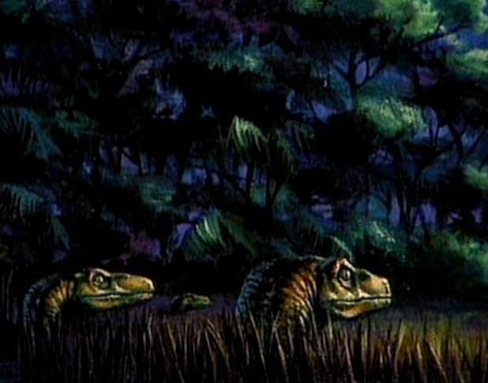

# Raptors
___

The Raptor Tribe is a dangerous pack of hunters who stalk the tall grasses looking for any opportunity. They always move in small packs, and if you see one it’s because they want you to. There are at least 3 more you are not seeing. They set traps, engage in ambushes, and kill swiftly. However, it is possible to deal with them. If they can be convinced there is a bigger prize, they are open to truces. However, this is always a temporary situation.

## Raptor
### Aspects
**[ A Lean Mean Predator Of The Grasslands ]**
**[ Hunt’s To Feed The Tribe ]**
**[ Am Never Without My Pack Mates ]**
**[ Agility And Speed ]**
**[ Has A Place, And Sticks To It ]**

### Approaches
**Quick**: +4
**Violent**: +3
**Instinctive**: +2
**Horrible**: +1

### Stunts
> When in tall grass or dense foliage, as long as one member of my pack is visible,
I can create a free secret aspect called “I Am A Clever Girl” indicating I am hidden.

### Stress
◽️◽️ Shaken
◽️◽️◽️ Hurt
◽️◽️◽️◽️ Giving In

___
[Monsters](Monsters.md)
